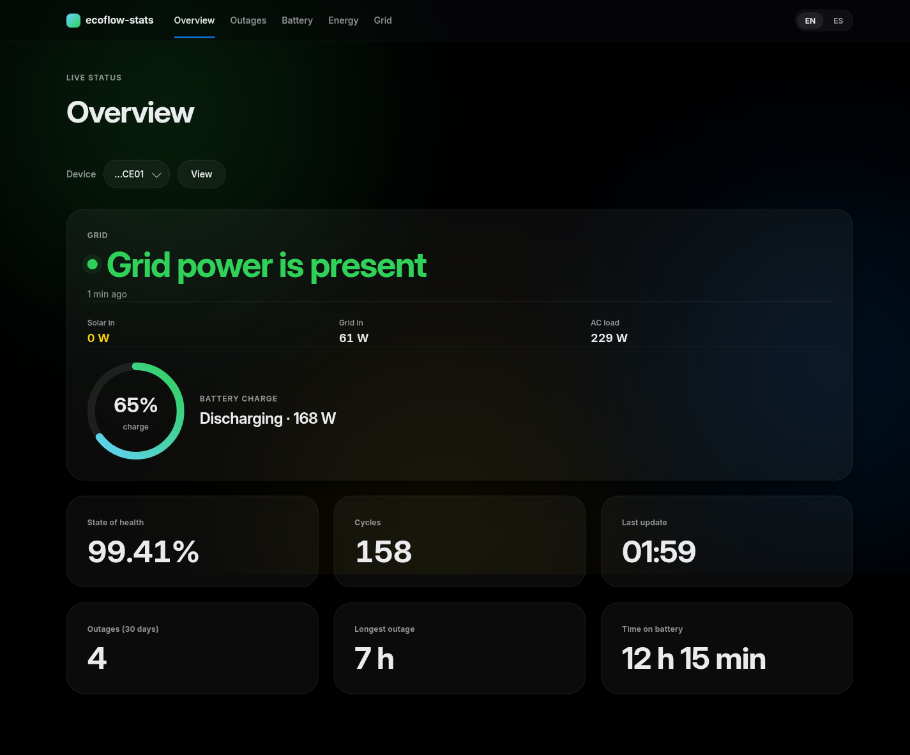
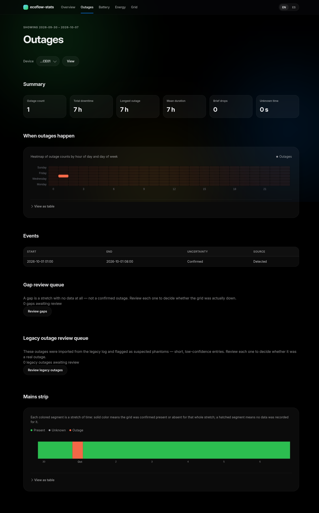
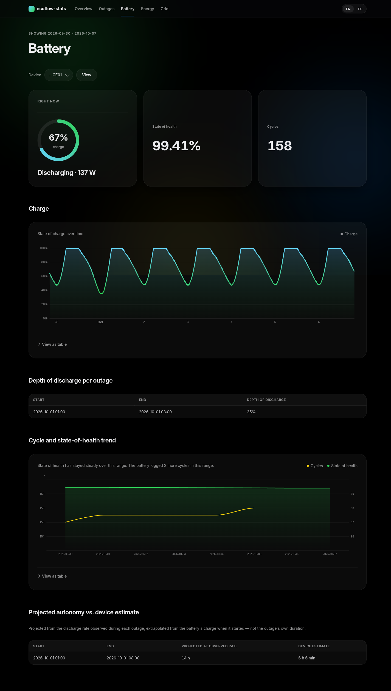
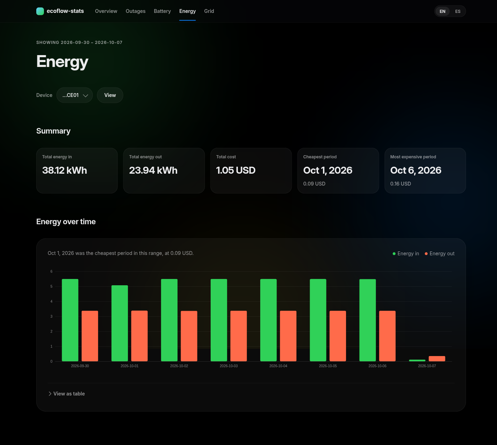
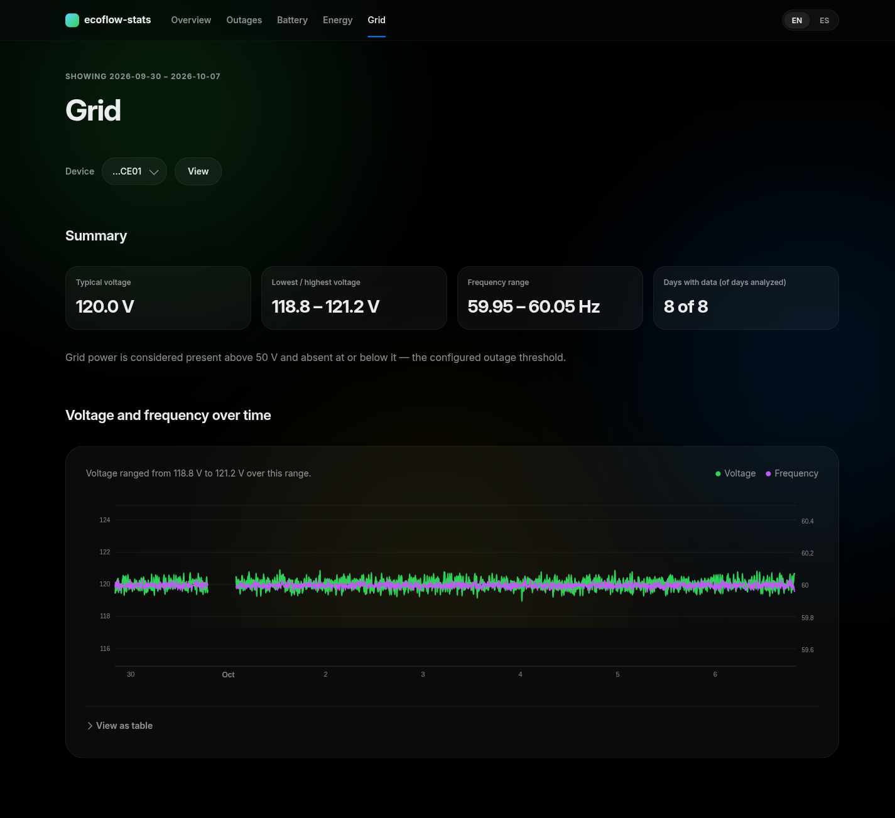

# ecoflow-stats

Self-hosted outage, energy and battery statistics for an EcoFlow power
station. A single Python process polls the EcoFlow cloud API read-only,
stores every sample in a local SQLite database, and serves a dark,
mobile-friendly dashboard over outages, battery health, energy cost and
grid quality — all on your own LAN, with no telemetry leaving your network.

Built for someone who already owns an EcoFlow unit and wants to answer
questions their phone app cannot: how many outages did the grid actually
have, how deep did each one cut into the battery, what did the electricity
actually cost this month, and is the mains voltage staying in a healthy
range.

## Who this is for

- You self-host small LAN services (Docker Compose, a home server, a
  Raspberry Pi) and want another one to join them.
- You own an EcoFlow DELTA Pro (or another model; see
  [`docs/adding-a-model.md`](docs/adding-a-model.md)) and want history the
  official app does not keep.
- You are comfortable setting environment variables and reading a
  `docker compose up` log.

This is read-only toward EcoFlow: the app only ever calls the two read-only
cloud endpoints (device list, device status). It never controls the power
station.

## Feature tour

### Overview

Live status at a glance: whether grid power is present right now, current
solar/grid/AC-load power, battery charge with time-to-full or time
remaining, state of health, cycle count, and the last 30 days' outage count
and longest outage.



### Outages

Summary totals (count, total downtime, longest, mean, brief drops, unknown
time), a weekday-by-hour heatmap of when outages happen, a detailed events
table with each event's time uncertainty and source (detected live vs.
imported from a legacy log), a gap review queue for stretches with no data
at all, and a 24-hour-per-row "mains strip" showing present/outage/unknown
time as a single colored band.



### Battery

State of charge over time, depth of discharge per outage, cycle count and
state-of-health trend, and projected autonomy (how long the battery would
have lasted from its charge at the start of each outage, at the discharge
rate observed during it) compared against the device's own remaining-time
estimate.



### Energy

Daily (or monthly, for ranges beyond 90 days) energy in/out by flow, with
cost computed from a configured flat tariff. Rows affected by a counter
reset, an implausible jump, or a data gap are flagged rather than silently
estimated.



### Grid

Voltage and frequency over time, with daily min/average/max and the
configured presence threshold shown alongside the chart.



Every page works with JavaScript disabled (server-rendered HTML with a
`<details>` fallback table under every chart), supports English and
Spanish, and never loads an external asset — ECharts and HTMX are vendored
locally.

## Quick start (Docker Compose)

1. Clone this repository and `cd` into it.
2. Copy `.env.example` to `.env` and fill in at least:
   - `ECOFLOW_ACCESS_KEY` / `ECOFLOW_SECRET_KEY` — your EcoFlow IoT Open API
     credentials.
   - `ECOFLOW_DEVICES` — your device's serial, e.g. `ECOFLOW_DEVICES=R331ZEB4SF7A0001`.

   See [`docs/configuration.md`](docs/configuration.md) for every variable,
   including the security-relevant ones (`ECOFLOW_STATS_PASSWORD`,
   `ECOFLOW_STATS_ALLOWED_NETWORKS`) if this host is reachable beyond your
   own machine.
3. Build and start:

   ```sh
   docker compose -f compose.example.yaml up -d --build
   ```

   (Or copy `compose.example.yaml` to `compose.yaml` first, so plain
   `docker compose up -d --build` picks it up.)
4. Open `http://<host>:8080/`. With no password configured, only clients on
   a private/LAN address can reach it (see
   [`docs/configuration.md`](docs/configuration.md)); a startup log line
   warns about this.
5. Already have history from the `ecoflow-panel` watcher? See
   [`docs/import.md`](docs/import.md) to bring it in.

The container's `HEALTHCHECK` runs `ecoflow-stats healthcheck` against its
own `/healthz` — no `curl` needed in the image.

## Documentation

| Doc | Covers |
|---|---|
| [`docs/configuration.md`](docs/configuration.md) | Every environment variable, its default and valid range, and how to expose the app safely |
| [`docs/import.md`](docs/import.md) | Importing history from the `ecoflow-panel` watcher (`samples.db`, `outages.log`) |
| [`docs/adding-a-model.md`](docs/adding-a-model.md) | Writing a device adapter for an EcoFlow model other than the DELTA Pro |
| [`CONTRIBUTING.md`](CONTRIBUTING.md) | Dev setup, tests, architecture, and commit conventions for contributors |

## License

MIT — see [`LICENSE`](LICENSE).
